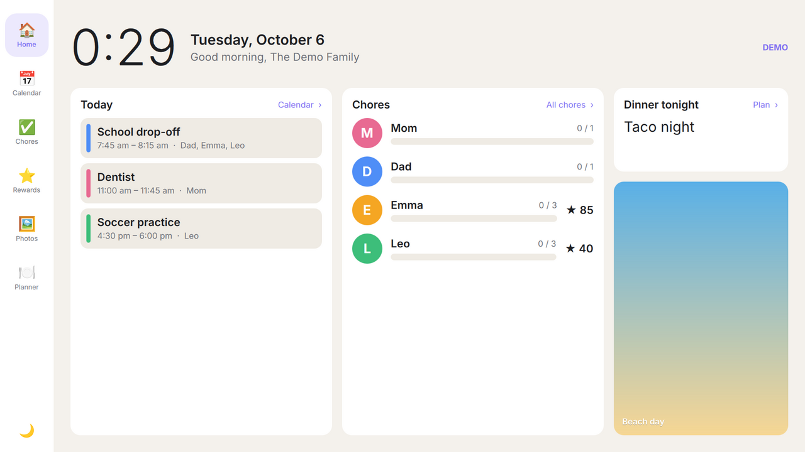
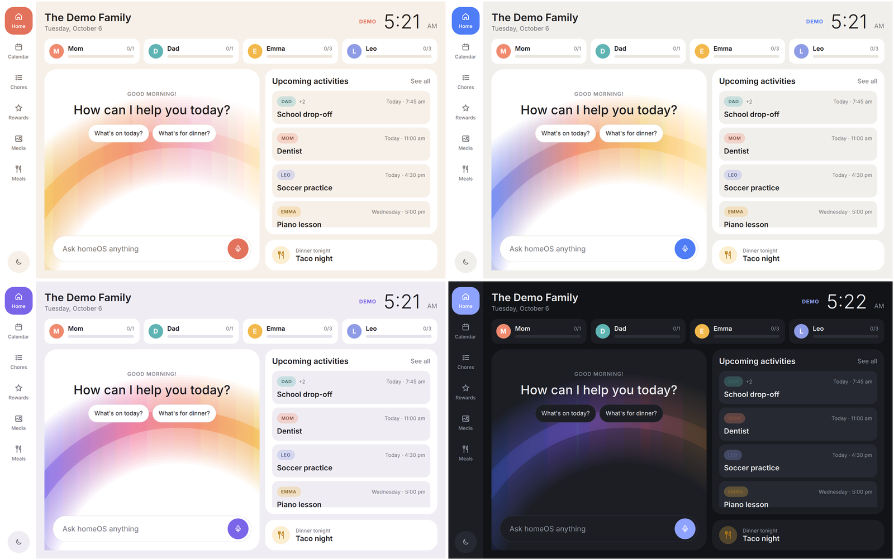
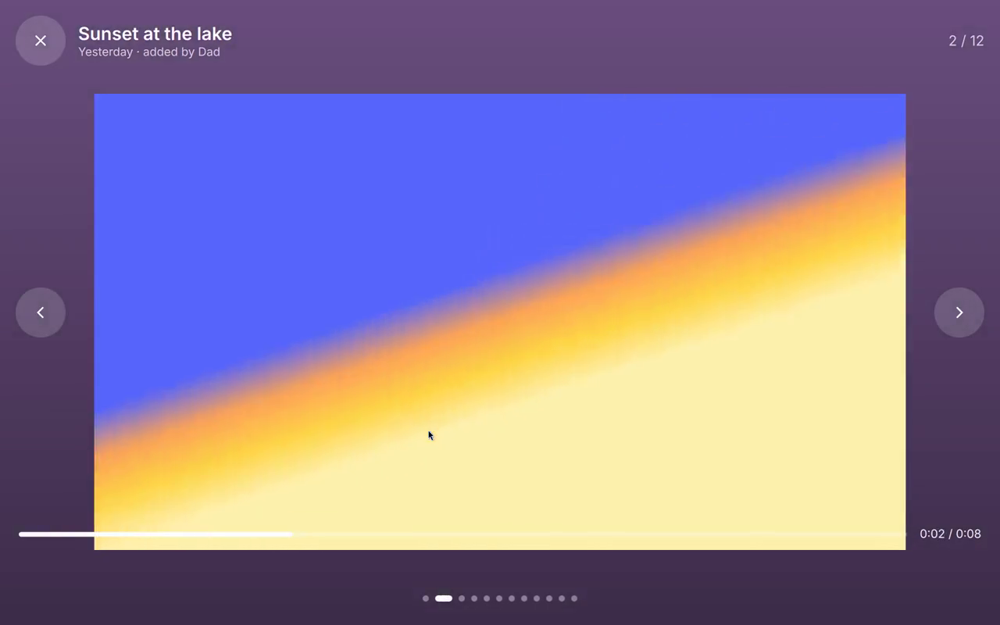
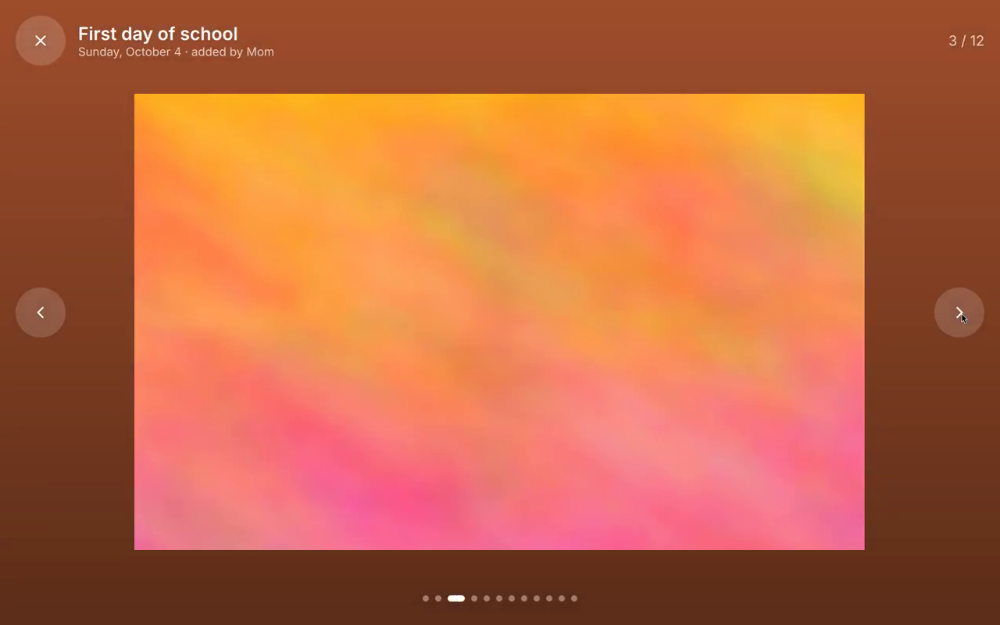
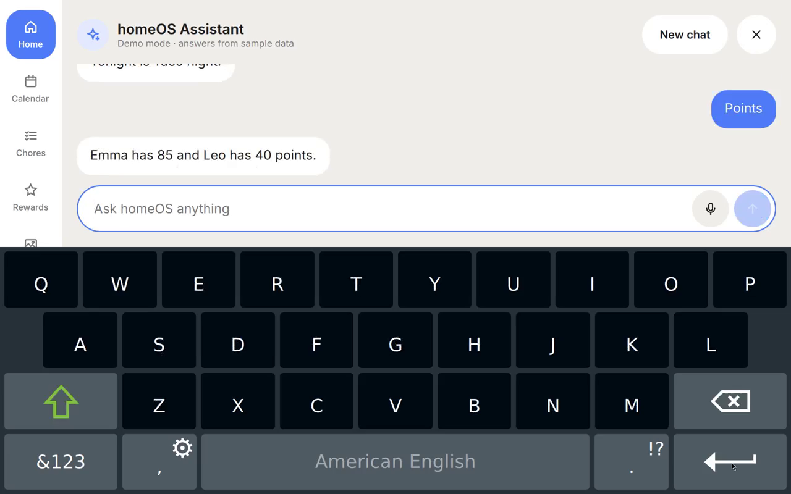
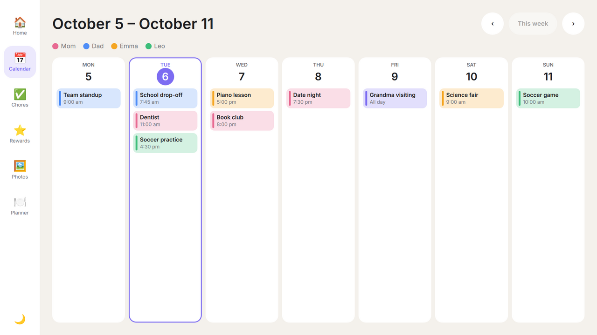
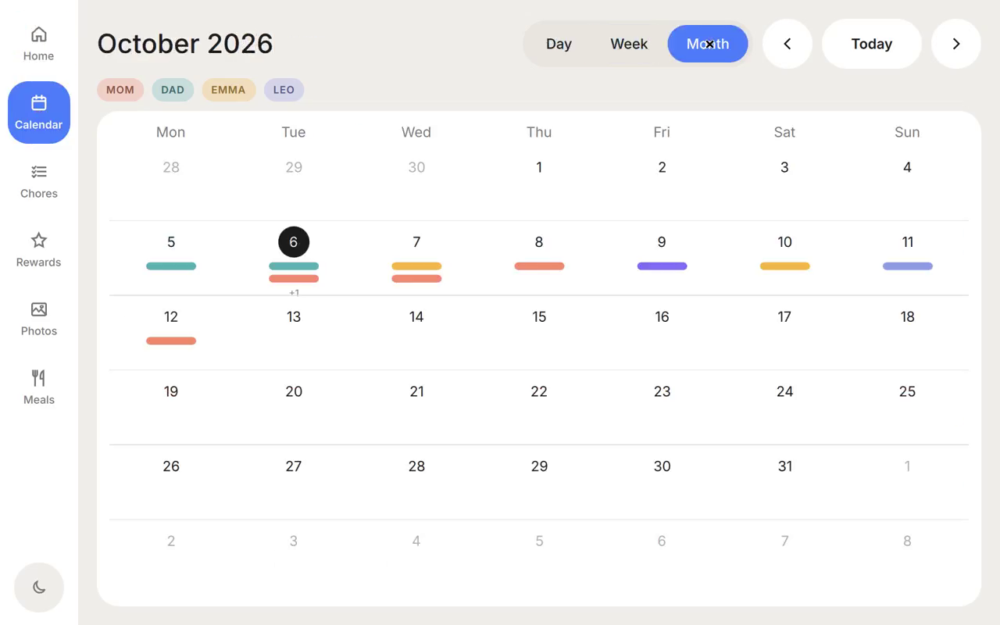
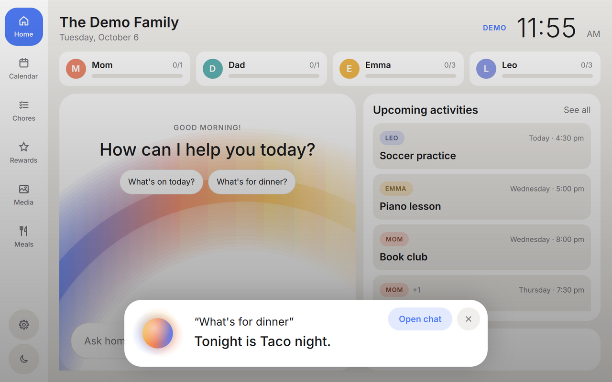
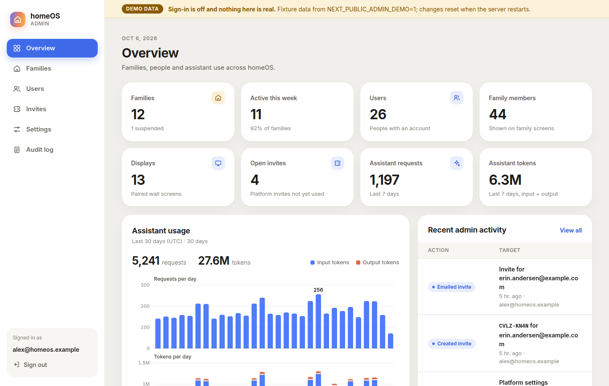

# Ohana

A family operating system: a wall-mounted touchscreen built on custom hardware,
plus an iOS app that family members use to feed it. It's invite-only, and a
small admin console runs the platform.

| Module    | What it does                                                        |
|-----------|---------------------------------------------------------------------|
| Calendar  | Shared family calendar, color-coded per member, synced via the cloud |
| Tasks     | Chores and to-dos with assignees, recurrence and due dates          |
| Rewards   | Points earned from chores, redeemable for family-defined rewards    |
| Media     | Family photos and videos, plus a photo-frame mode when idle         |
| Planning  | Meal plan, shopping lists and weekly planning                       |
| Assistant | Chat grounded in the family's data, with a wake word for quick spoken answers |



Dynamic colors: the palette follows the time of day (morning, day, evening, night).



<p>
  
  
  
  

  
  
  
</p>

## Repository layout

```
homeOS/
├── display/   Native touchscreen app (Qt 6 / QML / C++) for the wall device
├── ios/       Native iOS companion app (SwiftUI) for phones
├── backend/   Cloud backend (Supabase: Postgres, Auth, Storage, Edge Functions)
├── admin/     Admin console (Next.js): families, users, invites, settings, audit
├── voice/     On-device voice service (Python): wake word, speech in and out
└── docs/      Architecture, platform spec, hardware and roadmap
```

## Quick start

### Display app (Linux desktop or the device)

```bash
sudo apt install qt6-base-dev qt6-declarative-dev qt6-multimedia-dev qt6-websockets-dev \
  qt6-shadertools-dev \
  qml6-module-qtquick qml6-module-qtquick-controls qml6-module-qtquick-layouts \
  qml6-module-qtquick-window qml6-module-qtquick-shapes qml6-module-qtmultimedia \
  qml6-module-qtquick-virtualkeyboard qml6-module-qt-labs-folderlistmodel
cmake -S display -B build/display && cmake --build build/display -j
./build/display/homeos-display            # runs in demo mode with sample data
```

Useful flags and variables:

| | |
|---|---|
| `--windowed` | Run in a window instead of full screen |
| `--demo` | Use sample data even if a backend is configured |
| `HOMEOS_IDLE_SECONDS=30` | Seconds before the screen saver starts (default 120) |
| `HOMEOS_BOOT_SECONDS=8` | Least time the boot screen holds the logo (default 5; `0` skips it) |
| `HOMEOS_SCREENSAVER=photos\|collage\|video` | Screen saver style (otherwise chosen on the Media page) |
| `HOMEOS_NIGHT_MODE=on\|off` | Force the night theme on or off |
| `QT_SCALE_FACTOR=1.5` | UI scale (1.5 for the 10.1" 1920×1200 panel) |
| `HOMEOS_MOOD=morning\|day\|evening\|night\|cycle` | Pin the time-of-day palette, or `cycle` through all four (demos) |
| `HOMEOS_VOICE_URL` | Voice service address (default `ws://127.0.0.1:8765`) |
| `HOMEOS_MEDIA_URL` | Admin app origin that signs private photo and video URLs (Vercel Blob) |

To connect it to the backend, set:

```bash
export HOMEOS_SUPABASE_URL=https://<project>.supabase.co
export HOMEOS_SUPABASE_ANON_KEY=<anon key>
export HOMEOS_MEDIA_URL=https://<admin-deployment>.vercel.app
```

The display then shows a 6-digit pairing code. Enter it in the iOS app under
Family → Pair a display. The display stores its session in
`~/.config/homeOS/display.conf`.

To set up the Raspberry Pi 5 device, or to simulate it with Docker, see
[docs/PI_SETUP.md](docs/PI_SETUP.md). One script installs everything and starts
the app on boot.

### Backend

```bash
cd backend && supabase start         # local stack (requires Docker + Supabase CLI)
supabase db reset                    # applies migrations and seed.sql
supabase functions deploy pair-device
supabase functions deploy assistant          # Claude: workload identity, docs/PLATFORM.md

supabase functions deploy admin
supabase functions deploy delete-account     # Delete account in the iOS app
tests/run.sh                         # SQL tests (RLS, invites, admin, ...) on a throwaway Postgres
```

Sign-up is invite-only. [docs/PLATFORM.md](docs/PLATFORM.md) covers making
the first admin, issuing invites and the optional auth hook.

### Admin console

```bash
cd admin && npm ci
NEXT_PUBLIC_ADMIN_DEMO=1 npm run dev   # sample data, no sign-in
```

For real use, set the Supabase URL and anon key and sign in as a platform
admin. See [docs/ADMIN.md](docs/ADMIN.md), which also covers deploying to Vercel.

### Voice service (optional)

The wake word, speech-to-text and spoken replies run on the Pi itself and need
a USB microphone. Install with `./display/deploy/install-pi.sh --with-voice`.
To try it without a mic, run the simulator and type commands:

```bash
pip install -e voice
python -m homeos_voice --simulate     # then type: wake what's for dinner
```

See [docs/VOICE.md](docs/VOICE.md).

### iOS app

```bash
open ios/OhanaOS.xcodeproj
```

Put your Supabase URL and anon key in `ios/Config/Local.xcconfig` (see
`Local.xcconfig.example`). The anon key is meant to ship in client apps;
row-level security protects the data. TestFlight steps are in
[docs/IOS.md](docs/IOS.md).

## Docs

- [Architecture](docs/ARCHITECTURE.md)
- [Platform spec](docs/PLATFORM_SPEC.md), the contract between all the parts
- [Accounts, invites and admins](docs/PLATFORM.md)
- [Admin console](docs/ADMIN.md) · [iOS app](docs/IOS.md) · [Voice service](docs/VOICE.md)
- [Hardware](docs/HARDWARE.md)
- [Raspberry Pi setup](docs/PI_SETUP.md)
- [Roadmap](docs/ROADMAP.md)
