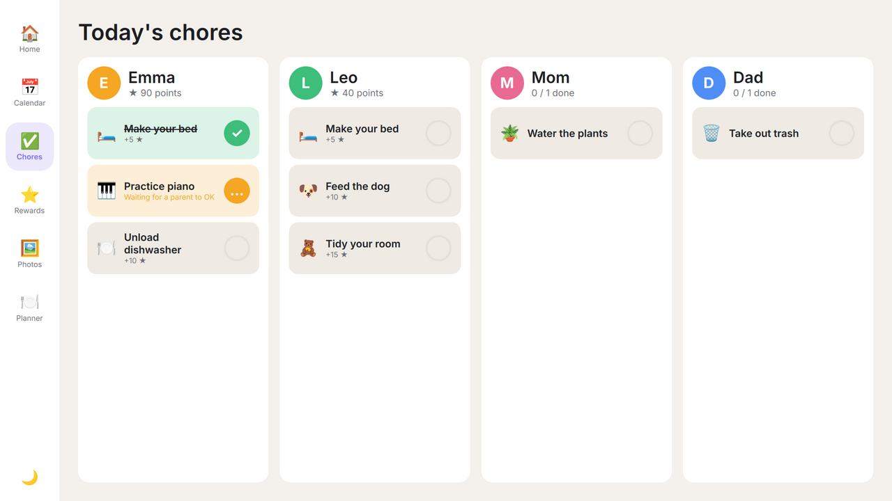
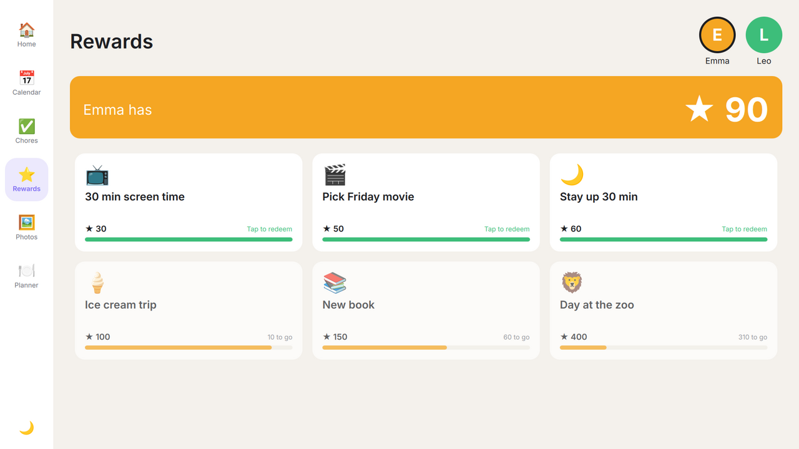

# homeOS

A family operating system: a wall-mounted touchscreen built on custom hardware,
plus an iOS app that family members use to feed it.

| Module    | What it does                                                        |
|-----------|---------------------------------------------------------------------|
| Calendar  | Shared family calendar, color-coded per member, synced via the cloud |
| Tasks     | Chores and to-dos with assignees, recurrence and due dates          |
| Rewards   | Points earned from chores, redeemable for family-defined rewards    |
| Media     | Family photos and videos, plus a photo-frame mode when idle         |
| Planning  | Meal plan, shopping lists and weekly planning                       |


<p>
  
  
  
</p>

## Repository layout

```
homeOS/
├── display/   Native touchscreen app (Qt 6 / QML / C++) for the wall device
├── ios/       Native iOS companion app (SwiftUI) for phones
├── backend/   Cloud backend (Supabase: Postgres, Auth, Storage, Realtime)
└── docs/      Architecture, hardware and roadmap
```

## Quick start

### Display app (Linux desktop or the device)

```bash
sudo apt install qt6-base-dev qt6-declarative-dev qt6-multimedia-dev \
  qml6-module-qtquick qml6-module-qtquick-controls qml6-module-qtquick-layouts \
  qml6-module-qtquick-window qml6-module-qtmultimedia
cmake -S display -B build/display && cmake --build build/display -j
./build/display/homeos-display            # runs in demo mode with sample data
```

Useful flags and variables:

| | |
|---|---|
| `--windowed` | Run in a window instead of full screen |
| `--demo` | Use sample data even if a backend is configured |
| `HOMEOS_IDLE_SECONDS=30` | Seconds before the photo frame starts (default 120) |
| `HOMEOS_NIGHT_MODE=on\|off` | Force the night theme on or off |

To connect it to the backend, set:

```bash
export HOMEOS_SUPABASE_URL=https://<project>.supabase.co
export HOMEOS_SUPABASE_ANON_KEY=<anon key>
```

The display then shows a 6-digit pairing code. Enter it in the iOS app under
Family → Pair a display. The display stores its session in
`~/.config/homeOS/display.conf`.

On the device, run it as a kiosk with `display/deploy/homeos-display.service`,
which renders straight to the panel through EGLFS.

### Backend

```bash
cd backend && supabase start         # local stack (requires Docker + Supabase CLI)
supabase db reset                    # applies migrations and seed.sql
supabase functions deploy pair-device
tests/run.sh                         # RLS + points tests against a throwaway Postgres
```

### iOS app

```bash
brew install xcodegen
cd ios && xcodegen && open HomeOS.xcodeproj
```

Put your Supabase URL and anon key in `ios/HomeOS/App/Config.swift`. The anon
key is meant to ship in client apps; row-level security protects the data.

## Docs

- [Architecture](docs/ARCHITECTURE.md)
- [Hardware](docs/HARDWARE.md)
- [Roadmap](docs/ROADMAP.md)
